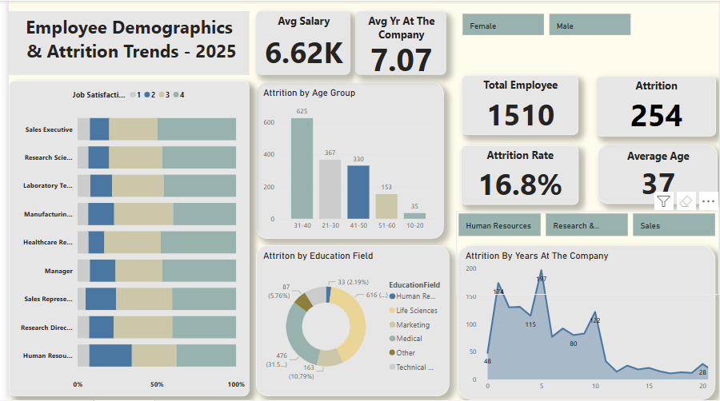

# HR Analytics Dashboard – Power BI Project
 

## Overview

This project explores employee attrition and engagement trends using an HR dataset. It leverages Power BI for interactive visualization and storytelling. The core objective is to **identify factors that influence employee turnover** and to provide actionable insights for HR departments.

## Problem Statement

Employee attrition is a critical concern in any organization. High turnover rates lead to:

- Increased recruitment and training costs
- Reduced productivity and morale
- Loss of institutional knowledge

However, many organizations struggle to understand **why** employees leave. The lack of visibility into employee behavior, satisfaction, and engagement metrics often hinders proactive interventions.

## ✅ Solution

This HR Analytics Dashboard solves the problem by:

- Tracking and comparing attrition across job roles, departments, and age groups
- Identifying high-risk employee segments (e.g., those who work overtime, or are less satisfied)
- Visualizing relationships between factors like **Job Satisfaction**, **Overtime**, **Monthly Income**, and **Attrition**
- Enabling HR managers to make **data-driven decisions** about employee retention strategies

---

## 📊 Tools & Technologies

- **Power BI**: Data Visualization
- **Excel**: Data Cleaning
- **DAX**: For calculated measures (Attrition Rate, Age Grouping, etc.)
- **Power Query Editor**: For data transformation

---

## Dataset

The dataset includes various employee attributes such as:

| Feature | Description |
|--------|-------------|
| Age | Numeric value |
| Attrition | Yes/No (Target Variable) |
| Department | Sales, R&D, HR |
| Job Satisfaction | Scale of 1–4 |
| Distance From Home | Numeric |
| Monthly Income | Salary in USD |
| Years At Company | Employee tenure |
| Overtime | Yes/No |
| Job Role | Position held |

---

## Exploratory Data Analysis (EDA)

### Data Preparation
- Removed duplicates, ensured clean column headers
- Checked for missing values
- Added **Age Group** using a calculated column

### DAX Measures
```dax
Attrition Count = CALCULATE(COUNTROWS(EmployeeData), EmployeeData[Attrition] = "Yes")

Attrition Rate = 
DIVIDE(
  CALCULATE(COUNTROWS(EmployeeData), EmployeeData[Attrition] = "Yes"),
  COUNTROWS(EmployeeData),
  0
).
```
---
## Dashboard Visualizations

The Power BI dashboard contains:

- **KPI Cards**: Attrition Rate, Average Years at Company
- **Bar Charts**: Attrition by Department, Job Satisfaction by Department
- **Pie Chart**: Overtime vs Attrition Distribution
- **Stacked Bar**: Age Group vs Attrition
- **Line Chart**: Monthly Income Trend across Job Roles
- **Table View**: Selected Employee Details


## Insights

- **Employees aged 31–40** have the highest attrition rate.
- **Overtime workers** are significantly more likely to leave.
- **Sales and R&D departments** show lower job satisfaction compared to HR.
- A large portion of employees **leave within the first 2–3 years**, suggesting onboarding gaps.
- **Higher income** doesn't always correlate with higher retention — culture and satisfaction matter more.

## Conclusion

This dashboard helps HR professionals and decision-makers:

- Understand attrition patterns
- Identify high-risk employee segments
- Formulate data-driven employee retention strategies
- Communicate findings through impactful visuals

## Future Enhancements

- Connect to live HR databases
- Use Power BI’s AutoML to predict attrition likelihood
- Build HR scorecards for individual employee

## Feedback

Feel free to fork this repo, use the dashboard, or suggest improvements via issues or pull requests.


